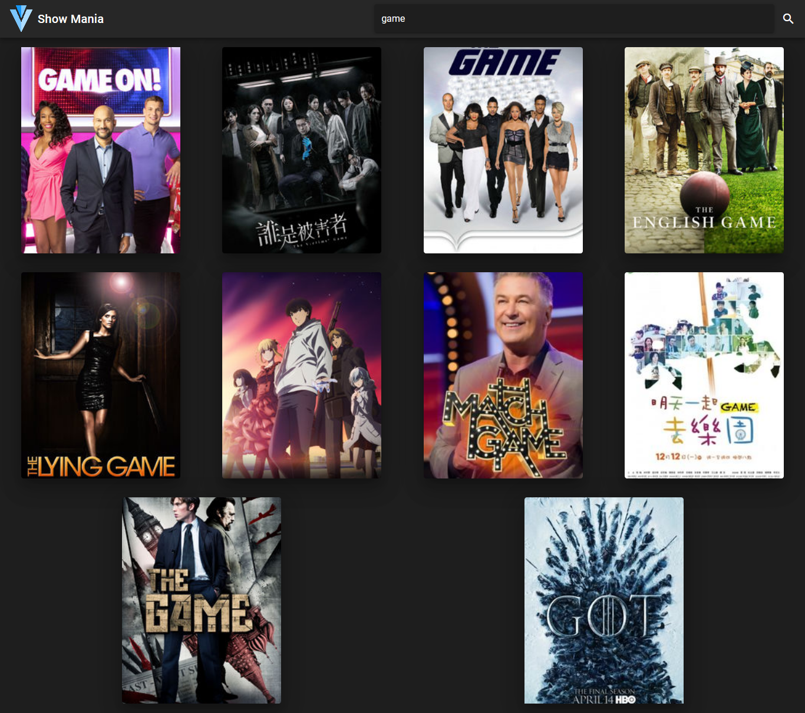

# tv-shows

This app will display TV shows based on different genres (drama, comedy, sports, etc.).
It also shows top 5 shows as carousel in homepage.
It has search feature.
It has a detailed description page for each show.

## Screenshots

### Homepage


### Details page


### Search page


## Installations -------------
### Vue CLI
```
This has some advantages.
Please refer below urls

https://cli.vuejs.org/

https://cli.vuejs.org/guide/

```
### Project setup (loading/importing all required packages)
Note: You need administrator privileges to execute these unless npm was installed on your system through a Node.js version manager.

### Setting up vue/cli
```
npm install -g @vue/cli

Note: You can check you have the right version with this command:
vue --version
```

### Installation of all required packages
```
npm install
Note: Run in a separate terminal or cmd.
```

### Compiles and hot-reloads for frontend development
```
npm run serve
```

### Compiles and minifies for production
```
npm run build
```

### Lints and fixes files
```
npm run lint
```

## Project Guidelines -----

1) File Naming Convention, 
   Method Naming Convention, 
   Component Naming Convention,
   variable, object declaration : camelCase

2) Folder Naming Convention, Components directives in vue : kabab-case

3) Coding Standards  
   a. kabab-case:
      vue component directives, css classes etc.
   b. camelCase:
      vue component file names, js variables, objects, functions etc
   c. PascalCase:
      importing npm packages etc. 


## Project dependencies and devDependencies ---------
1. axios:
   Promise based HTTP client for the browser.
   Please refer below url for more details:
   https://www.npmjs.com/package/axios   

2. vuetify:
   Vuetify is a Vue UI Library with beautifully handcrafted Material Components. we can build responsive, mobile-first, and ARIA accessible projects on the web using Vue.js and the world's most popular front-end CSS library — Material Design Component Framework. Release cadence : Weekly
   Please refer below url for more details:
   https://vuetifyjs.com/en/getting-started/quick-start

3. @vue/cli-plugin-unit-jest:
   Run unit tests with Jest. Jest as a JS unit testing framework and runner.
   Please refer below url for more details:
   https://jestjs.io/

   In jest.config.js: we can configure some key feature such as collectCoverage, collectCoverageFrom, coverageThreshold etc
   for getting exact code coverage with reports.

### Customize configuration
See [Configuration Reference](https://cli.vuejs.org/config/).
